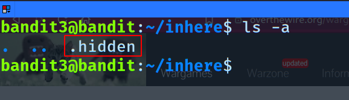

# Level 0 
	
**In this level we have to login to `bandit.labs.overthewire.org`, on port `2220`**

username : _bandit0_ 
password : _bandit0_

- to login via ssh go to the temrinal and use:
	- `ssh <username>@<url> <port>`
	- `ssh bandit0@bandit.labs.overthewire.org -p 2220`
- now once we are logged in, we have to go to the next level.

***
# Level 0 → Level 1

**Now that we are told that the password is stored in a file called `readme`**

- so let's use the command `ls` to list all the files in the current directory.
- we can see a file called `readme`, to view the contents of that file, we can use the `cat` and command, `cat <filename>`
- and we get the password for the next level!

***

# Level 1 → Level 2

**we have to get the password from a file called `-`**

- let's login using `ssh bandit1@bandit.labs.overthewire.org -p 2220` (`ssh <username>@<url> <port>`)
- now let's see what is in the home directory using the `ls -l` command.
	- the `-l` uses a long listing format
- we can find a file `-`, but if we try using the command `cat -`, we wont get anything in return but the shell is waiting for user input, i.e it interprets `-` as redirection.
- to overcome this we can use `cat ./-`

***
# Level 2 → Level 3

**We have to retrieve the password from a file called `spaces in this filename`**

> login with this : `ssh bandit2@bandit.labs.overthewire.org -p 2220`
- if we try `cat spaces in this file name`, we get an error, as the terminal iterpretes each space seperated word as a seperate file. 
- to overcome this, we can use `cat "spaces in this file name"` or `cat spaces\ in\ this\ filename`

***

# Level 3 → Level 4

> login : `ssh bandit3@bandit.labs.overthewire.org -p 2220`

**The password for the next level is stored in a hidden file in the `inhere` directory**

- let's use the command `ls` to view the contents of the current directory, we can see the `inhere` directory.
- to go into that directory we can use the `cd` (Change Directory) command, `cd inhere`
- if we use the `ls` command we won't be able to see any files or directories, as the file is hidden.
- to view the hidden files we need to use the command `ls -a`, we can see that the file is called `.hidden`
	
- to view this file we can use `cat .hidden`