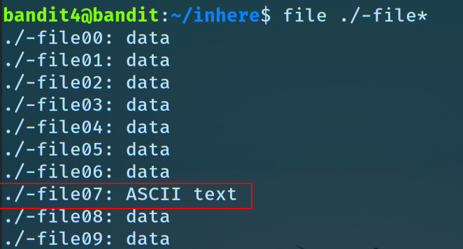

# Level 4 → Level 5

> login : `ssh bandit4@bandit.labs.overthewire.org -p 2220`

**the password is stored in a human-readable file in the `inhere` directory**

- let's `cd inhere` into the directory and see the contents of the directory using the `ls` command
- to find the _human readable_ file, we can use the command `file` this is used to determine the file type (please use the man pages `man file`, or google to learn more about it.)
- now executing `man ./-file00` `man ./-file01` is very time consuming, so
- let's do `file ./-file*` , this command returns the file types of all the files in the directory starting with `-file`
and ending with sequence of strings (we use `*` )
	
- -file07, returned ASCII, i.e human readable text,
- now we can use `cat ./-file07` to get the password!