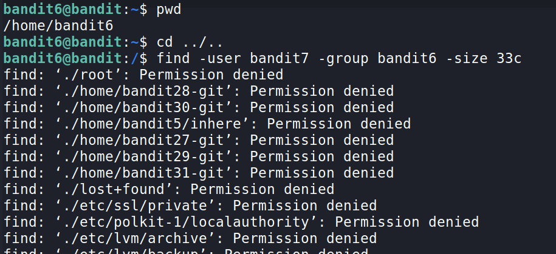
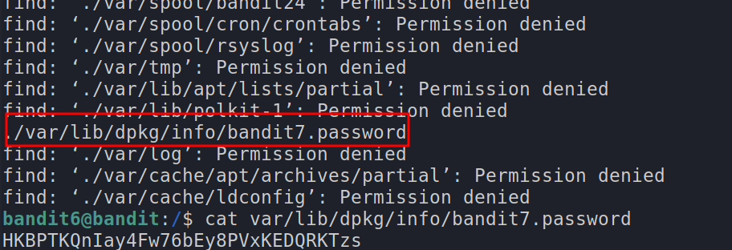

# Level 6 → Level 7

**The password for the next level is stored somewhere on the server and has all of the following properties:**
	- owned by user bandit7
	- owned by group bandit6
	- 33 bytes in size

- let's `ls` in our directory, we find not files, and the files exists `somewhere` on the server.
- so let's go to the root directory using `cd ../..`
- now we can use the `find -user bandit7 -group bandit6 -size 33c`
	- read the mand page of find `man find`
	
	

***
# Level 7 → Level 8

**The password for the next level is stored in the file `data.txt` next to the word millionth**

- if we try to `cat` the file,  we can't find it as the file is very big (`wc data.txt`)
- so let's use `grep`
- `grep "millionth" data.txt` (`grep "{{search_pattern}}" {{path/to/file}}`)
- we get the password for the next level!

***
# Level 8 → Level 9

**The password for the next level is stored in the file `data.txt` and is the only line of text that `occurs only once`**

- 