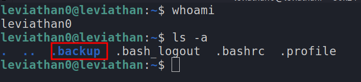
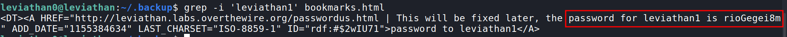
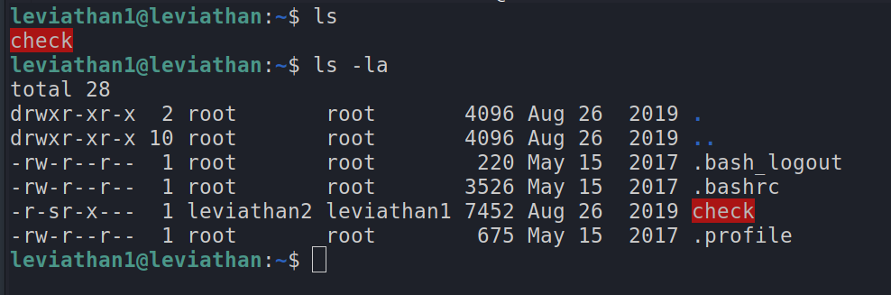
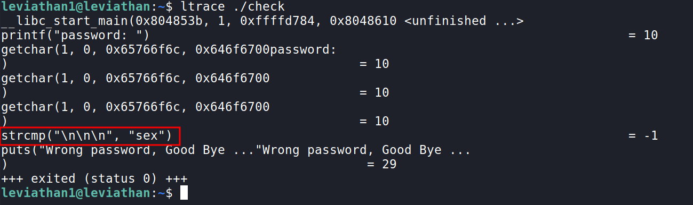
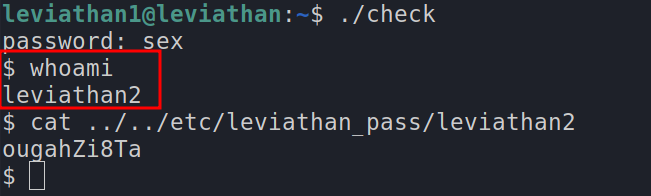

# Leviathan Level 0

`ssh leviathan0@leviathan.labs.overthewire.org -p 2223`

password : leviathan0

- once we login we are in `leviathan0`'s home directory
- let's see what's there here by using the `ls` command
- hmm... we can't find anything
- let's try `ls -a`, this shows the hidden files and directories (file's having a dot`.` at the start of their name)
- we get this

- the `.backup` directory looks intersting, let's `cd` (change directory) into it `cd .backup/`
- we can find a file called `bookmarks.html`
- now let's open it.....this is file is really long, so reading through it is hectic and not the right way
- let's use the command `grep` (learn more about it `man grep`)
- `grep -i 'leviathan1' bookmarks.html`
	- `-i` is used to ignore case
	- this command basically searches for a word `leviathan1` in the file `bookmarks.html`
- we get the password for the next level!!

***

# Leviathan Level 0 → Level 1

`ssh leviathan1@leviathan.labs.overthewire.org -p 2223`

password : rioGegei8m

- when we `ls` we can find a file called `check` but it is highlighted, so i doubt it is a normal file

- when we run `file check` it tell's, it is a `setuid ELF 32-bit LSB executable`, so basically it is an executable
- now let's try running it `./check`
- when we run this, it asks us for a password
- let's try `asdf`, we get return saying it is a wrong password, so this check out inputed password with a stored password
- now to find the stored password, we can use a command `ltrace` ([Read More](https://linux.die.net/man/1/ltrace))
	- this basically helps us by showing the different libraries the executable is calling

- we find out that it compares out input password using the `strcmp` library, this basically compares two strings
- here it is comparing it to `sex`, hence that is the password!!
