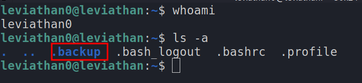
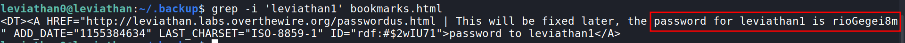
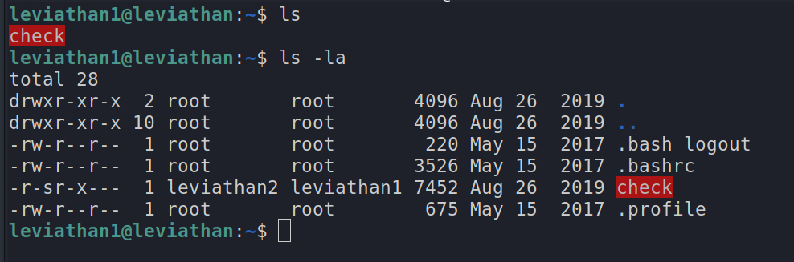
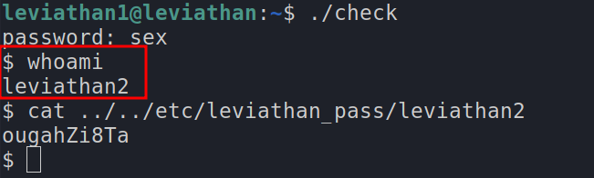
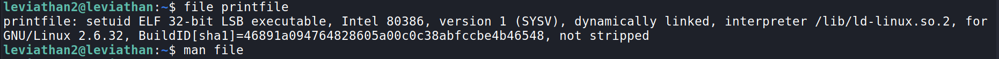
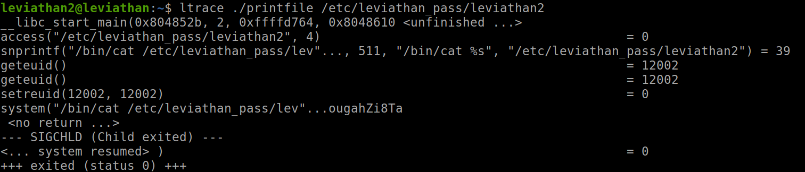

# Leviathan Level 0

`ssh leviathan0@leviathan.labs.overthewire.org -p 2223`

password : leviathan0

- once we login we are in `leviathan0`'s home directory
- let's see what's there here by using the `ls` command
- hmm... we can't find anything
- let's try `ls -a`, this shows the hidden files and directories (file's having a dot`.` at the start of their name)
- we get this


- the `.backup` directory looks intersting, let's `cd` (change directory) into it `cd .backup/`
- we can find a file called `bookmarks.html`
- now let's open it.....this is file is really long, so reading through it is hectic and not the right way
- let's use the command `grep` (learn more about it `man grep`)
- `grep -i 'leviathan1' bookmarks.html`
	- `-i` is used to ignore case
	- this command basically searches for a word `leviathan1` in the file `bookmarks.html`
- we get the password for the next level!!


***

# Leviathan Level 0 → Level 1

`ssh leviathan1@leviathan.labs.overthewire.org -p 2223`


- when we `ls` we can find a file called `check` but it is highlighted, so i doubt it is a normal file


- when we run `file check` it tell's, it is a `setuid ELF 32-bit LSB executable`, so basically it is an executable
- now let's try running it `./check`
- when we run this, it asks us for a password
- let's try `asdf`, we get return saying it is a wrong password, so this check out inputed password with a stored password
- now to find the stored password, we can use a command `ltrace` ([Read More](https://linux.die.net/man/1/ltrace))
	- this basically helps us by showing the different libraries the executable is calling

- we find out that it compares out input password using the `strcmp` library, this basically compares two strings
- here it is comparing it to `sex`, hence that is the password!!

- it spawns a shell for `leviathan2`, now `cat /etc/leviathan_pass/leviathan2`, to get the password for leviathan2

***

# Leviathan Level 1 → Level 2

`ssh leviathan2@leviathan.labs.overthewire.org -p 2223`


- now let's list the content of this directory using `ls`
- we find a file called `printfile`, let's see what kind of file it is using the `file` command

- it is an executable, so let's execute it using `./printfile`
	- we get back
	```
	*** File Printer ***
	Usage: ./printfile filename
	```
	- so we have to mention a filename, ex : `./printfile someFile`
	- let's try `./printfile .profile`, we get back the contents of the file `.profile`, so this program basically prints out the file content
	- now let's try seeing the password from the file `/etc/leviathan_pass/leviathan3` → `./printfile /etc/leviathan_pass/leviathan3`
	we get `You cant have that file...`
	- let's try the same command but with ltrace `ltrace ./printfile /etc/leviathan_pass/leviathan3`
	
		- we can see that the `access` library checks if we have permissions to access the file and it returns `-1` i.e we don't have access 
	- now let's try giving a `ltrace ./printfile /etc/leviathan_pass/leviathan2`
	
		- we can see that the `access` return `0`, which means we have access
		- and `snprintf` formats and stores the content of that file as a string
		- then the `setreuid` checks if the real user id (RUID), and not the effictive user id(EUID), has enough permissions to access the file
		- the `system` command is used to execute a command, and we can see there is no input sanitization here, so we should find a way to exploit this
			- as the system command is executed only when we have access, we should exploit this
			- let's create a file `touch "/tmp/lvl2;sh"`
			- here the file gets created and the semicolon `;` is used as the termination of a command, and then we give `sh` to spawn a shell which has the permissions to the `leviathan3`
		
- and we get the password!!

***

# Leviathan Level 2 → Level 3

- We find a file `level3` which we can execute
- `./level3` on execution we find it ask for a password
- Let's `ltrace` this file
- `ltrace ./level3`

- We can see it is comparing the entered string to `snlprintf`
- So we get the password
- 
- `cat /etc/leviathan_pass/leviathan4`

***

# Leviathan Level 3 → Level 4


- We get `binary` as out output
- Let's convert this binary to text (binary > decimal > ASCII value > Text)
- We can find an online toole [here](https://www.rapidtables.com/convert/number/binary-to-ascii.html)
- And we get the password for leviathan5!

***

# Leviathan Level 4 → Level 5

- So again `ls -la` and we find another executable
- `ltrace ./leviathan5`

- So this opens a file `/tmp/file.log` 
- Let's create the file `touch /tmp/file.log`
- `ltrace ./leviathan5`

- It gets the content of the file `fgetc`
- Lets create a symbolic link between `/etc/leviathan_pass/leviathan6` and `/tmp/file.log`
- `ln -s /etc/leviathan_pass/leviathan6 /tmp/file.log`
    - By doing this the content of `/etc/leviathan_pass/leviathan6` gets stored in `/tmp/file.log`
    - then when we run `./leviath5` it `fgetc` and prints the password!! 

***

# Leviathan Level 5 → Level 6

- Another executable
- When we run it it asks for a 4 digit code
- Let's brute force it using a bash script
- `touch /tmp/lvl6.sh`
```bash
#!/bin/bash

for a in {0000..9999}
do
	echo $a
	~/leviathan6 $a
done
```
``` bash
cd /tmp
./lvl6.sh
```
- and we get the password and it opens up a shell to `leviathan7`
- `cat /etc/leviathan_pass/leviathan7`

***

# Leviathan Level 6 → Level 7


- DONE, Stay tuned for more writeups !! Happy hacking :)