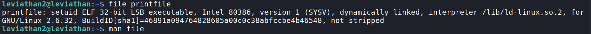
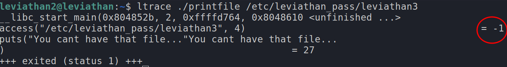
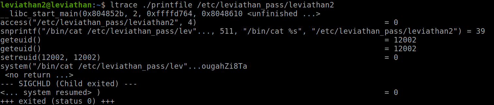
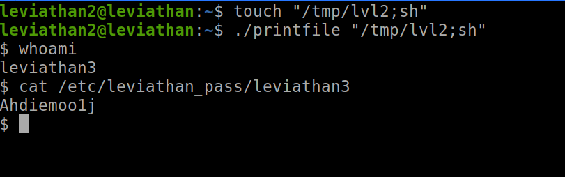

# Leviathan Level 1 → Level 2

`ssh leviathan2@leviathan.labs.overthewire.org -p 2223`

password : ougahZi8Ta

- now let's list the content of this directory using `ls`
- we find a file called `printfile`, let's see what kind of file it is using the `file` command

- it is an executable, so let's execute it using `./printfile`
	- we get back
	```
	*** File Printer ***
	Usage: ./printfile filename
	```
	- so we have to mention a filename, ex : `./printfile someFile`
	- let's try `./printfile .profile`, we get back the contents of the file `.profile`, so this program basically prints out the file content
	- now let's try seeing the password from the file `/etc/leviathan_pass/leviathan3` → `./printfile /etc/leviathan_pass/leviathan3`
	we get `You cant have that file...`
	- let's try the same command but with ltrace `ltrace ./printfile /etc/leviathan_pass/leviathan3`
	
		- we can see that the `access` library checks if we have permissions to access the file and it returns `-1` i.e we don't have access 
	- now let's try giving a `ltrace ./printfile /etc/leviathan_pass/leviathan2`
	
		- we can see that the `access` return `0`, which means we have access
		- and `snprintf` formats and stores the content of that file as a string
		- then the `setreuid` checks if the real user id (RUID), and not the effictive user id(EUID), has enough permissions to access the file
		- the `system` command is used to execute a command, and we can see there is no input sanitization here, so we should find a way to exploit this
			- as the system command is executed only when we have access, we should exploit this
			- let's create a file `touch "/tmp/lvl2;sh"`
			- here the file gets created and the semicolon `;` is used as the termination of a command, and then we give `sh` to spawn a shell which has the permissions to the `leviathan3`
		
- and we get the password!!