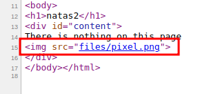
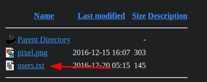

# Level 0

**In this level we should go to this url `http://natas0.natas.labs.overthewire.org`**

username : _natas0_

password : _natas0_

- now we can find the password to the next level on this site.
- so let's try viewing the source code : `ctrl + u` **or** `right click on the site and click on view page source`
- we can see the password is stored as a comment.

***

# Level 0 → Level 1

URL : http://natas1.natas.labs.overthewire.org/ 

**In this level rightclicking is blocked**

- so we can use the keyboard shortcut `ctrl + u`  to view the page source.

***

# Level 1 → Level 2

URL : http://natas2.natas.labs.overthewire.org/ 

- let's try viewing the page source `ctrl + u`
- we can find a link to an image, so let's click on it and open it.
- 
- this is picture has nothing interesting for us.
- but we can find the this image is stored in a directory called `files`
- so let's navigate to that directory `http://natas1.natas.labs.overthewire.org/files`
- here we find a files `users.txt` in which we can find the password for the next level!

****