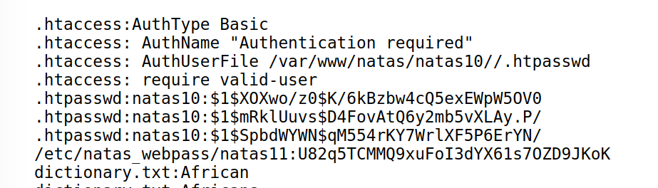

# Level 9 → Level 10

URL : http://natas10.natas.labs.overthewire.org
 
- like the previous level we have a search bar, where we can users can give their input
- but here, it says certain characters are filtered
- ok, let's read the source code
```html+php
<?
$key = "";

if(array_key_exists("needle", $_REQUEST)) {
    $key = $_REQUEST["needle"];
}

if($key != "") {
    if(preg_match('/[;|&]/',$key)) {
        print "Input contains an illegal character!";
    } else {
        passthru("grep -i $key dictionary.txt");
    }
}
?>
```
- we find that `/[;|&]/` are escaped, the function `preg_match` does this [read more](https://www.w3schools.com/php/func_regex_preg_match.asp)
- now we have to find a way to input a command without using these characters
- i tried searching for a way we can bypass this, but couldn't find any way
- now let's try playing around with `grep` command, (learn more about it by entering `man grep` in the terminal)
- so we can try `.* /etc/natas_webpass/natas11`, so when php reads it, it becomes
	- grep -i .* /etc/natas_webpass/natas11 dictionary.txt
	- now this doesn't only searches the `dictionary.txt` but also `.* /etc/natas_webpass/natas11`
	- here `.*` searches for all text in both files
	- now, this return the password for the next level!!
