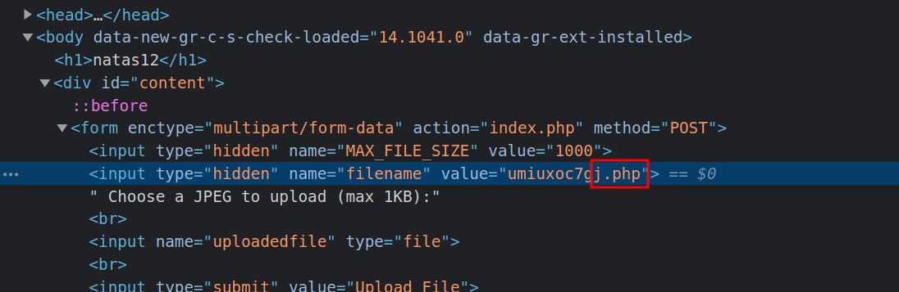

# Level 11 → Level 12

URL : http://natas12.natas.labs.overthewire.org

- In this level we can upload files, seems like a upload vulnerability
- let's read the sourcecode, okay, so the code has a few functions:
- This generates a random string ↴
```php
function genRandomString() {
    $length = 10;
    $characters = "0123456789abcdefghijklmnopqrstuvwxyz";
    $string = "";    

    for ($p = 0; $p < $length; $p++) {
        $string .= $characters[mt_rand(0, strlen($characters)-1)];
    }

    return $string;
}
```
- this generates a random path for the file we are going to upload ↴
```php
function makeRandomPath($dir, $ext) {
    do {
    $path = $dir."/".genRandomString().".".$ext;
    } while(file_exists($path));
    return $path;
}
```
- This just returns the directory path and the extension to the second function ↴
```php
function makeRandomPathFromFilename($dir, $fn) {
    $ext = pathinfo($fn, PATHINFO_EXTENSION);
    return makeRandomPath($dir, $ext);
}
```
- and the rest of the code checks if the file we have uploaded is less than `1KB` and it adds a `.jpg` extension to the file name
- This code doesn't check if the file we are uploading is actually a `.jpg` file, so we have to exploit this
- if you're using kali, we can find a php backdoor in `/usr/share/webshells/php`, called `simple-backdoor.php`
- so let's copy this file to out desktop `cp /usr/share/webshells/php ~/Desktop` and change it's name `mv simple-backdoor.php simple-backdoor.jpg`
- now let's upload this file 
- **Before clicking on upload** we should change the file extension from `.jpg` to `.php` and then click on upload

- once it's uploaded we can navigate to this URL : `http://natas12.natas.labs.overthewire.org/upload/183485x6i0.php?cmd=cat%20/etc/natas_webpass/natas13`
- and we get the password for the next level!!