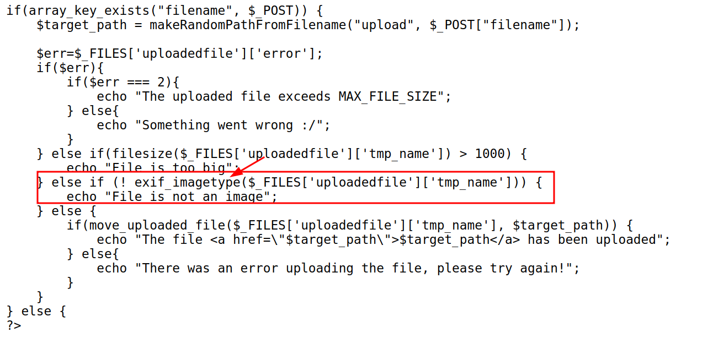
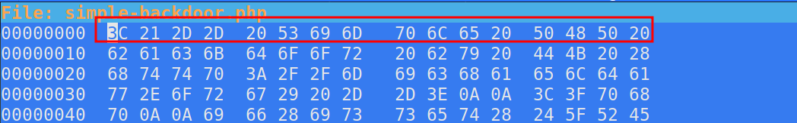
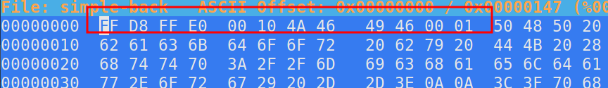
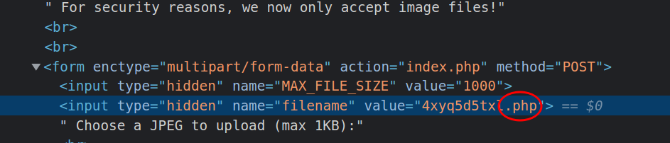

# Natas Level 12 → Level 13

URL : http://natas13.natas.labs.overthewire.org

- This is similar to the previous level, but this time it accepts only image files
- The functions `genRandomString()`, `makeRandomPath()`,  `makeRandomPathFromFilename()` do the same thing as on last level
- The difference is, there is a function called `exif_imagetype` [read more](https://www.php.net/manual/en/function.exif-imagetype.php), this basically checks the first few bytes of the file, to check wether it is a image(here jpeg) or not
	
- So we can't change only the extension, we have to change the first few bytes of a file, also known as the `magic number` [read more](https://en.wikipedia.org/wiki/List_of_file_signatures)
- Now let's use the php file available in kali at `/usr/share/webshells/simple-backdoor.php`
- Now we have to find a way to edit the bytes of this file so that it is accepted as a jpeg file, for this we can use the tool `hexeditor`
- The magic number for `.jpeg` is `FF D8 FF E0 00 10 4A 46 49 46 00 01`
- so let's start by `hexeditor simple-backdoor.php`
	
- after we edit, let's press `ctrl+x` to save and quit
	
- now let's upload this file, and change the extension from `.jpg` to `.php` ↴
	
- after uploading go to that uploaded URL and add URL`?cmd=cat%20/etc/natas_webpass/natas14`
	- my example : `http://natas13.natas.labs.overthewire.org/upload/ku6vnf5abp.php?cmd=cat%20/etc/natas_webpass/natas14`
- and we get the password for the next level!!

***