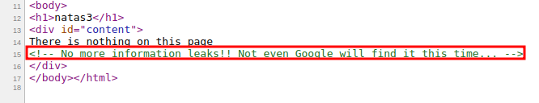
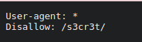
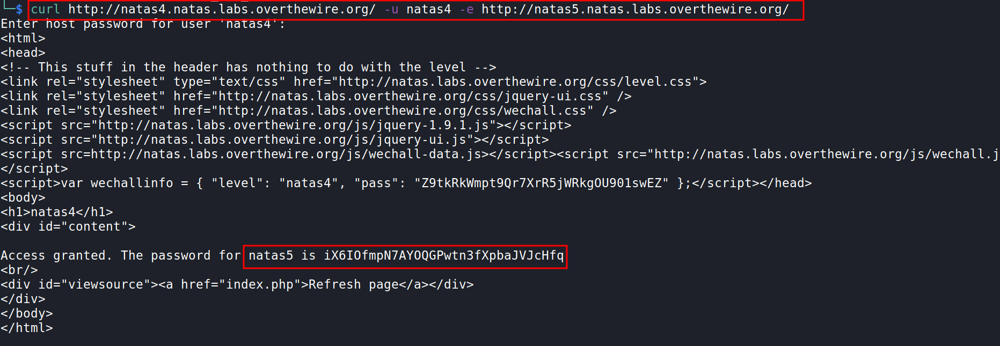

# Level 2 → Level 3

URL : http://natas3.natas.labs.overthewire.org/ 

- let's view the page source `ctrl + u`
- nothing interesting here but there's a comment that might be useful

- it says not even *google* can find it...hmmm
- this can mostly be talking about the `robots.txt` page, which google uses to tell search engine crawlers which URLs the crawler can access on the site, it basically used to identify restricted or private areas of a site
- so let's navigate to that page : http://natas3.natas.labs.overthewire.org/robots.txt
- we find this	
- 
- what this basically tells is, no search engine should index the `/s3cr3t` directory
- so now let's navigate to it : http://natas3.natas.labs.overthewire.org/s3cr3t/
- we find a file `users.txt` which contains the password for next level!!

***

# Level 3 → Level 4

URL : http://natas4.natas.labs.overthewire.org/ 

**This level tells us `Access disallowed. You are visiting from "http://natas4.natas.labs.overthewire.org/" while authorized users should come only from "http://natas5.natas.labs.overthewire.org/"`**

- as always let's start by reading the source page
- nothing much for us here
- but it tells us we should be visiting this site from `http://natas5.natas.labs.overthewire.org/`
- so for this level let's use a command called `curl`, curl  is  a  tool  to transfer data from or to a server
- now we have to change the HTTP header : `referer` [read more here](https://developer.mozilla.org/en-US/docs/Web/HTTP/Headers/Referer) to `http://natas5.natas.labs.overthewire.org/`
- `curl http://natas4.natas.labs.overthewire.org/ -u natas4 -e http://natas5.natas.labs.overthewire.org/`
	- `-u` as this requires authentication, we provide a user, when prompted enter the natas4 level password
	- `-e` this provides the referer URL
	- `curl <url to get data from> -u <user> -e <referrer URL>`
- and there we go, we get the response with the password!!
