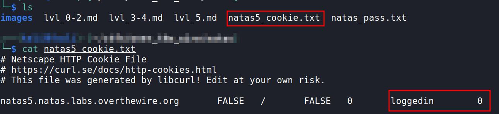
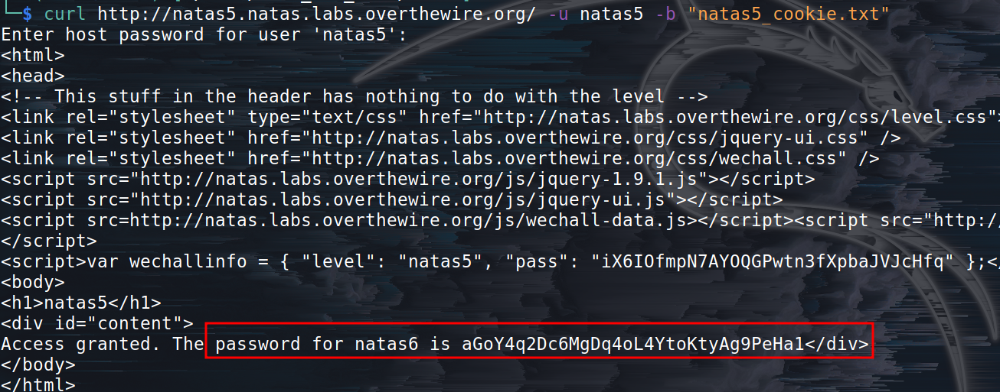

# Natas Level 4 → Level 5

URL : http://natas5.natas.labs.overthewire.org/ 

- after logging in, `natas5:iX6IOfmpN7AYOQGPwtn3fXpbaJVJcHfq`
- we can see a message `Access disallowed. You are not logged in`
- if we view the page source, we don't get anything useful
- so to solve this level, we should know what cookies are. Cookies are small pieces of data which store information about the user or computer for identification.
- now, we have to manipulate the cookie in such a way that we are logged in.
### First, by using `curl` command:

- curl  is  a  tool  to transfer data from or to a server
- `curl http://natas5.natas.labs.overthewire.org/ -u natas5 -c natas5_cookie.txt`
- `-u` as this requires authentication, we provide a user, when prompted enter the natas5 level password
- `c` is used to get the cookies of the website, and `natas5_cookie.txt` is the filename where the cookies will be stored
- please read the man page for more `man curl`

- after this, we get a file displaying the cookies

- now we have to edit the file and chang `loggedin` to `loggedin 1` (0 means false and 1 is true)
- now we need to send this edited cookie file, `curl http://natas5.natas.labs.overthewire.org/ -u natas5 -b natas5_cookie.txt"`
- here `b` is used to mention the cookie filename we modified
- and we get the password!!
 

- We can also do this by changing the cookie directly from the browser or by using some browser extension for cookie manipulation.
