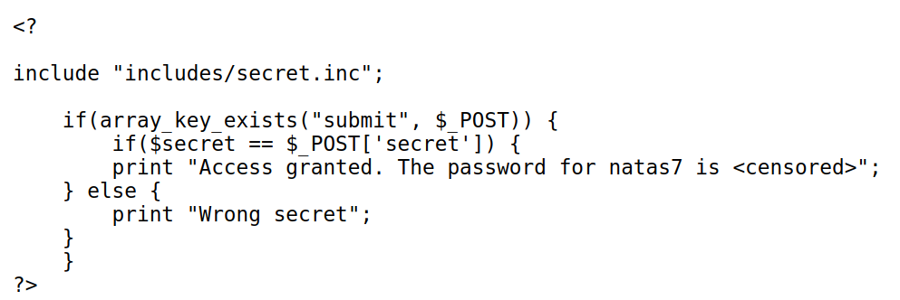

# Natas Level 5 → Level 6

URL : http://natas6.natas.labs.overthewire.org

- now this time we have something different, an input field.
- so to test what this does, let's just click submit....this throws a "wrong error" message.
- okay, now let's view the source code

- so we can find a php code, which takes in values from the input field (form) and compares it to a file located in `includes/secret.inc`
- so let's navigate to that page `http://natas6.natas.labs.overthewire.org/includes/secret.inc`
- we find the secret code, enter that and we'll get the password to the next level!!

***

# Natas Level 6 → Level 7
 
 - On this page we have two links `home`  and `about`
 - now let's read the page source (`ctrl + u`)
 - we can see a hint `<!-- hint: password for webuser natas8 is in /etc/natas_webpass/natas8 -->`
 - ok, when we navigate to them, notice the how the url changes
 	- http://natas7.natas.labs.overthewire.org/index.php?page=home
 	- it points to a page, which is directly passed into the php file
 	- so we can mention a path after `page` in the url
 	- let's try `/etc/natas_webpass/natas8` - http://natas7.natas.labs.overthewire.org/index.php?page=/etc/natas_webpass/natas8
 - we get the password for the next level
